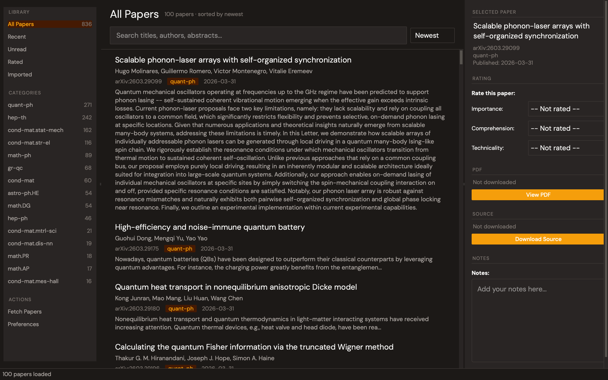

<p align="center">
  
</p>

# PaperTrail - arXiv Paper Management Application

A desktop application for efficiently managing and organizing arXiv papers for research workflows.



## Features

- **arXiv Integration**: Fetch papers by subject class (new submissions or recent papers)
- **Rich Metadata**: Store papers with full metadata including authors, categories, and abstracts
- **Rating System**: Three-metric rating system (importance, comprehension, technicality)
- **Note Taking**: Take notes directly on papers with full-text search
- **PDF Management**: On-demand download with customizable naming patterns, reveal in Finder
- **Source File Download**: Download and extract arXiv LaTeX source files
- **Smart Search**: Search your local library first, then optionally search arXiv directly
- **Reader Integration**: Opens PDFs in configurable PDF readers
- **Full-Text Search**: Fast FTS5-powered search across titles, abstracts, authors, and notes
- **Advanced Filtering**: Filter by categories, date ranges, rating status, and PDF availability
- **Theme Support**: Light and dark mode with Ctrl+T toggle
- **Preferences Dialog**: Configurable theme, font size, PDF settings, and fetch defaults
- **Library Management**: Relocate, export, or merge libraries with split database/files paths
- **Hierarchical Categories**: Smart grouping of arXiv categories by field (Physics, CS, Math, etc.)
- **Cross-Platform**: Works on macOS and Linux

## Installation

### Preparation

The run and build scripts will automatically create a `.venv` if one is not found, so no additional tooling is strictly required beyond Python 3.10+. However, using [`uv`](https://docs.astral.sh/uv/getting-started/installation/) is recommended for faster, reproducible dependency management. If you use another virtual environment manager, ensure the environment is placed in a local `.venv/` folder.

### Option 1: Pre-built Application (Recommended for macOS)

1. Download or build the .app bundle:
  ```bash
   ./build_app.sh
  ```
2. Copy to Applications folder:
  ```bash
   cp -r dist/PaperTrail.app /Applications/
  ```
3. If macOS Gatekeeper blocks the app (since it is not notarized), run:
  ```bash
   xattr -cr /Applications/PaperTrail.app
  ```
4. Launch from Launchpad or Spotlight

See [BUILDING.md](BUILDING.md) for detailed build instructions.

### Option 2: Run from Source

#### Prerequisites

- Python 3.10 or higher
- `uv` package manager (optional but recommended — see [Preparation](#preparation))

#### Setup

1. Clone or download this repository
2. Install dependencies:

```bash
uv sync          # if you have uv
# or
./run.sh         # auto-creates .venv and installs deps on first run
```

## Usage

### Running from Source

```bash
./run.sh
```

Or manually:

```bash
cd src
source ../.venv/bin/activate
python main.py
```

### Running the Installed App

- Launch from Applications folder
- Or: `open /Applications/PaperTrail.app`

### First Run

On first run, you'll be prompted to choose a data directory location. This is where:

- The SQLite database will be stored
- Downloaded PDFs will be saved
- Cache files will be kept

You can choose the default location or select a custom directory (e.g., in your cloud sync folder).

You can change this location later from Preferences > Storage.

### Fetching Papers

1. Click "Fetch Papers" in the toolbar (or press `Ctrl+Shift+F`)
2. Select arXiv categories (e.g., hep-th, cs.AI, gr-qc)
3. Choose fetch mode:
  - **New**: Today's new submissions
  - **Recent**: Papers from the last N days
4. Click Fetch

Papers will appear in the feed view with expandable/collapsible cells.

### Managing PDFs

When you click "View PDF" on a paper:

- If PDF is already downloaded, it opens immediately
- If not downloaded, you'll be asked:
  - **Download & Keep**: Save to permanent storage with custom naming
  - **Stream (Temp)**: Download to cache (cleaned on exit)
- Use **Show in Finder** to reveal the downloaded PDF in your file manager

### Managing Source Files

Click "Download Source" in the context panel to download a paper's LaTeX source from arXiv:

- **Download & Keep**: Extracts to permanent storage using the same naming pattern as PDFs
- **Stream (Temp)**: Extracts to cache (cleaned on exit)
- Once downloaded, click "Open Source" to open the source directory in your file manager

### Application Layout

The interface uses a three-panel layout:

1. **Navigation Rail** (left) — Library views (All Papers, Recent, Unread, Rated, Imported), category filters with paper counts
2. **Paper Feed** (center) — Search bar, sort options, scrollable list of paper cards
3. **Context Panel** (right) — Selected paper details, rating controls, PDF/source management, notes editor

### Rating Papers

Select a paper in the feed, then use the rating controls in the context panel:

- **Importance**: path-breaking, good, routine, passable, meh, trash
- **Comprehension**: understood, partially understood, not understood
- **Technicality**: tough, not tough, doesn't make sense

### Taking Notes

Select a paper and use the notes editor in the context panel. Notes auto-save after 2 seconds of inactivity.

### Searching & Filtering

- **Full-text search** across titles, abstracts, and authors (powered by FTS5) via the search bar in the feed
- **arXiv search fallback**: When local results aren't enough, search arXiv directly from the feed
- **Category filtering** in the navigation rail with hierarchical grouping (Physics, CS, Math, etc.) and paper counts
- **Library views**: All Papers, Recent, Unread, Rated, Imported
- **Sort by**: newest first, oldest first, title A-Z, or title Z-A

### Managing Your Library

You can relocate or merge your library after initial setup via **Preferences > Storage**.

Three migration modes are available:

- **Export**: Copies your database and files to new locations. The originals are preserved so you can verify before deleting them.
- **Create New**: Starts a fresh, empty library at the chosen locations.
- **Merge**: Merges your current papers into an existing library at the destination. When duplicates are found (by arXiv ID), you can choose to keep the existing version, keep the incoming version, or keep both.

The database and files directories can point to different locations (e.g., database on a fast local drive, PDFs in a synced folder). After a migration, previous library paths are shown in the Storage tab for easy cleanup.

## Configuration

### Naming Pattern

Default: `[{author1}_{author2}][{title}][{arxiv_id}].pdf`

This pattern is used for both PDF filenames and source download folder names.

Available variables:

- `{author1}`: First author last name
- `{author2}`: Second author last name
- `{authors_all}`: All authors
- `{title}`: Paper title
- `{arxiv_id}`: arXiv ID
- `{year}`: Publication year

Example: `Smith_Jones_Attention_Is_All_You_Need_2301.12345.pdf`

### PDF Reader

**macOS**: Automatically uses Skim (or Preview as fallback)

**Linux**: Auto-detects installed readers (evince, okular, xpdf, atril, mupdf)

You can set a custom reader path in Preferences.

### Preferences

Access via **File > Preferences** (or Cmd+, on macOS):

- **General**: Theme (light/dark), font size (8-20pt)
- **PDF**: Reader path, default download behavior (ask/download/stream), naming pattern
- **Fetching**: Max results per category, default fetch mode, number of recent days
- **Storage**: Current library locations, change library location, previous library cleanup

### Keyboard Shortcuts


| Shortcut            | Action                  |
| ------------------- | ----------------------- |
| `Ctrl+T`            | Toggle light/dark theme |
| `Ctrl+F`            | Focus search bar        |
| `Ctrl+Shift+F`      | Fetch papers            |
| `F5` / `Ctrl+R`     | Refresh paper list      |
| `Cmd+,` / `Ctrl+,`  | Open Preferences        |
| `Cmd+Q` / `Ctrl+Q`  | Quit                    |


## Documentation

- **[README.md](README.md)** - This file, user guide
- **[BUILDING.md](BUILDING.md)** - Build and distribution instructions

## Development

### Project Structure

```
PaperTrail/
├── src/
│   ├── main.py                    # Application entry point
│   ├── models.py                  # Data models
│   ├── database/                  # Database layer
│   │   ├── connection.py
│   │   ├── repositories.py
│   │   ├── migration_manager.py
│   │   └── migrations/
│   ├── api/                       # External API integrations
│   │   └── arxiv_client.py
│   ├── services/                  # Business logic
│   │   ├── config_service.py
│   │   ├── paper_service.py
│   │   ├── pdf_service.py
│   │   ├── source_service.py
│   │   └── fetch_service.py
│   ├── ui/                        # User interface
│   │   ├── main_window.py
│   │   ├── theme.py               # Light/dark theme system
│   │   ├── widgets/
│   │   │   ├── paper_cell_widget.py
│   │   │   ├── paper_feed_widget.py
│   │   │   ├── context_panel_widget.py
│   │   │   ├── filter_panel_widget.py
│   │   │   ├── rating_widget.py
│   │   │   └── note_editor_widget.py
│   │   └── dialogs/
│   │       ├── fetch_papers_dialog.py
│   │       ├── pdf_action_dialog.py
│   │       ├── arxiv_search_results_dialog.py
│   │       ├── change_library_dialog.py
│   │       ├── merge_conflict_dialog.py
│   │       └── preferences_dialog.py
│   ├── assets/                    # App resources
│   │   ├── AppIcon.icns           # Application icon
│   │   └── fonts/                 # Bundled fonts (Source Serif 4, DM Sans, JetBrains Mono)
│   └── utils/                     # Utilities
│       ├── platform_utils.py
│       ├── async_utils.py
│       ├── download_utils.py
│       ├── filename_utils.py
│       └── library_migration.py
├── data/                          # Runtime data (user-chosen location)
├── tests/                         # Test suite
└── pyproject.toml
```

### Running Tests

```bash
pytest tests/
```

## Future Features

- Author citation metrics from InspireHEP
- AI-powered keyword extraction
- PDF annotation import from Skim
- Export to BibTeX

## License

AGPL-3.0-only. See [LICENSE](LICENSE) for details.

## Contributing

Contributions welcome! Please open an issue or pull request.

## Support

For issues or questions, please open a GitHub issue.
